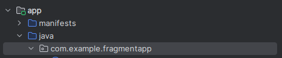

# Fragments

### What?

Fragments are containers in an activity that can store or dynamically load views. They are like a container `div` of HTML

### Why?

So fragments are useful to load dynamic views in the runtime, hide, show , toggle views

### How to create Fragments?

#### Steps:

1. Ad frame layout or fragment in the main layout file

```xml
    <FrameLayout
        android:id="@+id/frame"
        android:layout_width="390dp"
        android:layout_height="657dp"
        app:layout_constraintEnd_toEndOf="parent"
        app:layout_constraintStart_toStartOf="parent"
        app:layout_constraintTop_toTopOf="parent">
    </FrameLayout>
```

2. Now click on java file and create an empty fragment 
    <br> Right click on the package name `com.example.fragmentapp` Than `New -> Fragment -> Fragment (Blank)`
3. Give it a name and activity name as well
4. Add whatever style you want in your layout.
5. And than add the following code 
   
   ```kotlin
   package com.example.fragmentapp
   
   import android.os.Bundle
   import androidx.fragment.app.Fragment
   import android.view.LayoutInflater
   import android.view.View
   import android.view.ViewGroup
   
   class Frag1 : Fragment() {
       // TODO: Rename and change types of parameters
       private var param1: String? = null
       private var param2: String? = null
   
       override fun onCreate(savedInstanceState: Bundle?) {
           super.onCreate(savedInstanceState)
   
       }
   
       override fun onCreateView(
           inflater: LayoutInflater, container: ViewGroup?,
           savedInstanceState: Bundle?
       ): View? {
           // Inflate the layout for this fragment
           return inflater.inflate(R.layout.fragment_frag1, container, false)
       }
   
       companion object {
           @JvmStatic
           fun newInstance(param1: String, param2: String) =
               Frag1().apply {
               }
       }
   }
   ```

6. Now edit **MainActivity.kt** and to load the fragment in the frame use the following line of code]
7. `supportFragmentManager.beginTransaction().replace(R.id.frame, Frag1()).commit()`
8. Don't forget to change the parameter `R.id.frame` with the frame id and `Frag1()` with the classname of the fragment classname