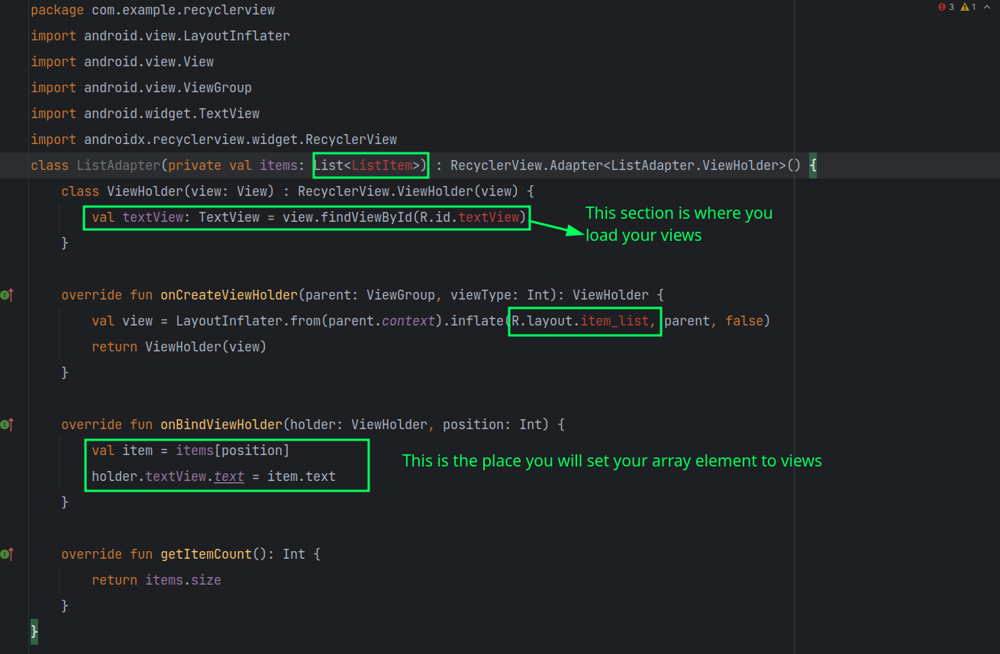
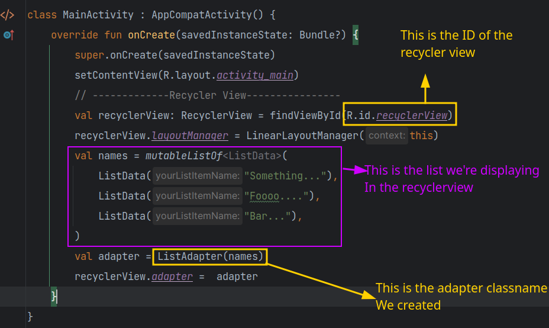

# Recyclerview

### What?

Recyclerview in android allows  creating a list which is recycled that makes it efficient

### How to create a basic Recyclerview

1. Add the following in your `gradle.build` file `implementation("androidx.recyclerview:recyclerview:1.3.2")` and sync

2. Than go to your `activity_layout.xml` file and create a new recyclerview give it an id 

3. Now create a layout for it, This layout will tell how your list items will look like for example `list_item_layout.kt`
   
   ```xml
   <?xml version="1.0" encoding="utf-8"?>
   <androidx.constraintlayout.widget.ConstraintLayout xmlns:android="http://schemas.android.com/apk/res/android"
       xmlns:app="http://schemas.android.com/apk/res-auto"
       xmlns:tools="http://schemas.android.com/tools"
       android:layout_width="match_parent"
       android:layout_height="100dp"
       android:padding="10dp">
   
       <TextView
           android:id="@+id/tvtext"
           android:layout_width="wrap_content"
           android:layout_height="wrap_content"
           android:text="TextView"
           android:textSize="18dp"
           app:layout_constraintBottom_toBottomOf="parent"
           app:layout_constraintStart_toStartOf="parent"
           app:layout_constraintTop_toTopOf="parent" />
   </androidx.constraintlayout.widget.ConstraintLayout>
   ```

4. Now each recycler view needs two classes, 
   
   1. for data model which is a class that has no body only a constructor
   
   2. for the view holder which is the actual class that handles the recycler view

5. Hence create a data model class which should look like this `ListData.kt`
   
   ```kotlin
   package com.example.recyclerview
   
   class ListData(
       val item: String
   )
   ```

6. Next Create a view holder/adapter class which will look like this `ListAdapter.kt`
   
   ```kotlin
   package com.example.recyclerview
   import android.view.LayoutInflater
   import android.view.View
   import android.view.ViewGroup
   import android.widget.TextView
   import androidx.recyclerview.widget.RecyclerView
   //ListData is your data class
   class ListAdapter(private val items: List<ListData>) : RecyclerView.Adapter<ListAdapter.ViewHolder>() {
       class ViewHolder(view: View) : RecyclerView.ViewHolder(view) {
           val textView: TextView = view.findViewById(R.id.tvtext)
       }
   
       override fun onCreateViewHolder(parent: ViewGroup, viewType: Int): ViewHolder {
           val view = LayoutInflater.from(parent.context).inflate(R.layout.list_item, parent, false)
           return ViewHolder(view)
       }
   
       override fun onBindViewHolder(holder: ViewHolder, position: Int) {
           val item = items[position]
           holder.textView.text = item.yourListItemName 
       }
   
       override fun getItemCount(): Int {
           return items.size
       }
   }
   
   ```

Now this is almost a boilerplate code with the changes are denoted by the screenshot with lime boxes

                    

7. The next thing we need to update the actual activity where we are actually showing the recycler view for instance `MainActivity.kt` here we need to initiate the list
   
   ```kotlin
   val recyclerView: RecyclerView = findViewById(R.id.recyclerView)
           recyclerView.layoutManager = LinearLayoutManager(this)
           val names = mutableListOf<ListData>(
               ListData("Something..."),
               ListData("Foooo...."),
               ListData("Bar..."),
           )
           val adapter = ListAdapter(names)
           recyclerView.adapter =  adapter
   ```

**Explanation and Changes**



Here all the yellow boxes represents changes

### Updating the list

**Insert Element**

In order to update the list we first need to update the list or array which is fed into the recyclerview. Let's say you want to insert one element at the end of the list hence

```kotlin
list.add(Item("Item X") // Adding an item in the array
adapter.notifyItemInserted(list.size - 1) // updating recycler adapter
```

**Clear List**: 

```kotlin
items.clear()
notifyDataSetChanged()
```

**Adding New Data set**

```kotlin
items.clear()
items.addAll(newItems)
notifyDataSetChanged()
```

Remember all these operations will happen in the `MainAcitvity.xml` just after the creation of recyclerview

Firebase or  network pushes can be handled accordingly 
